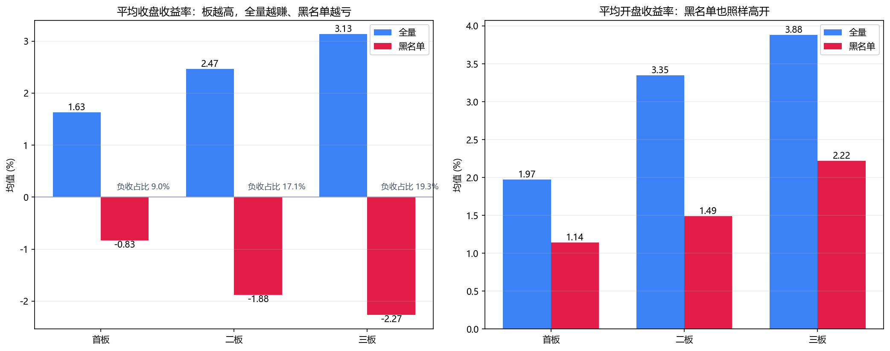

# nboard-blacklist

统计 A 股**第 N 个连续涨停板**（首板 / 二板 / 三板 …）在**次日**的表现，生成"黑名单"。

> 只做研究统计，**不构成任何投资建议**。

## 它做什么

对每只票历史上每一次"第 N 板"事件，统计其次一交易日相对当日收盘价的三档收益率：

| 维度 | 公式 | 看什么 |
|---|---|---|
| 开盘收益率 | T+1 open / T close − 1 | 隔夜情绪、能否高开走 |
| 最高收益率 | T+1 high / T close − 1 | 盘中冲高空间 |
| 收盘收益率 | T+1 close / T close − 1 | 持有到尾盘的真实结果 |

再给出高开概率、收盘上涨概率、亏损次数占比，并把"平均收盘收益为负"的票列为黑名单。

## 口径

- **第 N 板**（默认"恰好第 N 板"）：T 日及前 N-1 日连续涨停，且 T-N 日未涨停；`--at-least` 可切"至少 N 板"。
- **涨停判定**：优先用交易所涨停价（`收盘 >= 涨停价`）；开源数据无该字段时用板块规则计算涨停价。
- **涨停幅度**：主板 10% / 创业板·科创板 20% / 北交所 30% / ST 5%；创业板 20% 自 2020-08-24 起。
- **停牌**：剔除次日停牌样本；前收用停牌前最后成交价，复牌涨停可识别。
- 详见 [`docs/methodology.md`](docs/methodology.md)。

## 一个已验证的结论

2019-01-01 ~ 2026-09-24，主板（剔除 ST/科创/北交/创业板）：**板越高，溢价越高，坑也越深**。

| 板数 | 全量 | 平均开盘 | 平均最高 | 平均收盘 | 收盘为负占比 | 黑名单 | 黑名单平均收盘 |
|---|---|---|---|---|---|---|---|
| 首板 | 2931 | +1.97% | +5.51% | +1.63% | 9.0% | 267 | -0.83% |
| 二板 | 1875 | +3.35% | +7.12% | +2.47% | 17.1% | 320 | -1.88% |
| 三板 | 766 | +3.88% | +7.49% | +3.13% | 19.3% | 148 | -2.27% |

> 坑票形态高度一致：**高开低走**（二板黑名单 77%、三板黑名单 80% 都是"平均高开、平均收绿"）。



## 安装

```bash
pip install -r requirements.txt
```

## 快速开始

### 方式一：开源数据（AKShare，默认）

```bash
# 先用少量股票试跑
python scripts/run_open.py --source akshare --level 1 --max-stocks 50

# 全市场（较慢，建议开缓存后重跑）
python scripts/run_open.py --source akshare --level 2 --start 2019-01-01 --end 2026-09-24
```

AKShare 一直报代理/连接错误时，换 **Baostock**（不走 HTTP 代理）：

```bash
python scripts/run_open.py --source baostock --level 1 --max-stocks 50
```

产物：`output/全量统计_2板_*.csv`、`output/黑名单_2板_*.csv`。

### 方式二：聚宽数据（精确涨停价）

在 joinquant.com **研究环境** Notebook 里运行 `scripts/run_joinquant.py`（或把内容粘进 cell）。
聚宽提供 `high_limit` / `paused`，无需自行算涨停价。

## 目录结构

```
src/nboard/
  core.py        # 数据源无关：N板掩码 + T+1 三档统计
  rules.py       # 涨停规则（板块/ST/历史变更）
  pipeline.py    # 数据源 -> 统计 -> CSV
  sources/
    akshare_source.py    # 开源默认
    baostock_source.py   # 开源备选（不走 HTTP 代理）
    joinquant_source.py  # 聚宽（精确涨停价）
scripts/
  run_open.py          # 开源数据命令行
  run_joinquant.py     # 聚宽研究环境入口
tests/test_core.py
```

## 常见问题

**所有股票都报 `ProxyError` / `ConnectionError`？**

系统开启了代理，但代理连不上或不放行东方财富。AKShare 会读取系统代理环境变量，本工具**默认自动绕开系统代理**；若仍失败：

- 显式指定可用代理：`--proxy http://127.0.0.1:7890`
- 保留系统代理：`--keep-proxy`
- 或改用聚宽数据：在研究环境跑 `scripts/run_joinquant.py`

## 局限

- 历史统计，不代表未来；样本过少的票会被剔除；
- AKShare 无精确涨停价，用规则计算，个别低价股/新股可能有误差；
- 默认不复权计算（涨停判定更准），除权日的收益有少量噪声；
- 未考虑滑点、一字板无法成交、注册制新股前 5 日无涨跌幅等交易细节。

## 免责声明

本项目为数据统计工具，仅供研究学习，**不构成任何投资建议**。据此操作，风险自负。

## License

[MIT](LICENSE)
